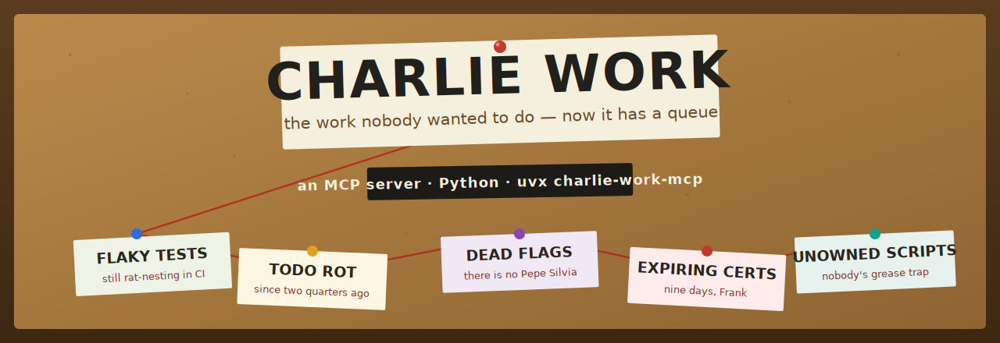

<div align="center">



# Charlie Work

**An MCP server that surfaces — and dignifies — the toil in your repo.**

The un-fun, load-bearing maintenance work everyone ignores until it bites: flaky tests, a TLS cert nine days from death, dead feature flags, TODO rot, dependencies pinned to nothing, scripts nobody owns. Charlie Work scans your repo, hands you a **prioritized queue**, and keeps a **credit ledger** so the invisible work finally shows up in standup.

*Named after the episode where the gang realizes Charlie has been quietly holding Paddy's together the whole time.*

</div>

---

> **THIS IS CHARLIE WORK. Nobody else will do it. That's why it's yours.**

The jokes are a **toggle, not a tax** — pass `mode="plain"` (or set `CHARLIE_VOICE=off`) and every response comes back flavor-free, paste-into-a-ticket clean. Same data, no bit.

## Quickstart

Run it straight from the repo with [`uv`](https://docs.astral.sh/uv/) — no clone, no build:

```bash
uvx --from git+https://github.com/Falcon305/charlie-work-mcp charlie-work-mcp
```

Then point your MCP client at it. For **Claude Desktop** / **Cursor** (`mcpServers` config):

```json
{
  "mcpServers": {
    "charlie-work": {
      "command": "uvx",
      "args": ["--from", "git+https://github.com/Falcon305/charlie-work-mcp", "charlie-work-mcp"]
    }
  }
}
```

Now ask your agent: *"Run Charlie Work on this repo and tell me what nobody's doing."*

## What it does

Three sharp tools. Each does something an LLM can't do on its own — walk the real tree, hold persistent state, reach live data.

| Tool | What it does |
|------|--------------|
| `charlie_scan_toil` | Scans a repo and returns a prioritized toil queue (severity × effort × staleness). Paginated. Filter by `kinds`. |
| `charlie_did_it` | Records that someone cleared a piece of toil, by its `toil_id`. Persists to a local ledger. |
| `charlie_ledger` | Reports the credit ledger for standup: who cleared what, the Champion of the Grease Trap, and what's still open. |

### Real output

```
THIS IS CHARLIE WORK. Nobody else will do it. That's why it's yours.

🔒 TLS certificate expires in 8 days (certs/staging.pem) — the clock is running, Frank
🎯 Focused test left in — the rest of the suite isn't running (tests/checkout.spec.js:1)
🐀 Flaky test papered over with retries (tests/test_login.py:9) — it keeps rat-nesting in CI
📌 FIXME left in the code (notes.py:3)
📦 Dependency 'left-pad' is pinned to '*' — a rug that will pull itself (package.json)
📦 Dependency 'flask' has no version pin — whatever ships, ships (requirements.txt:1)

11 thing(s) nobody wanted to do. Showing 6 from #0.
```

The machine-readable payload rides alongside as structured content — `[{id, kind, path, line, title, evidence, severity, effort, staleness_days, priority}]` — so an agent can act on it directly.

```
THE LEDGER. Somebody did the work. It gets written down.
👑 Champion of the Grease Trap: dee
  dee cleared 1 — respect.
Still on the board: 11. Somebody's gotta do it.
```

## What it looks for

| Kind | Signal |
|------|--------|
| `expiring_cert` | `.pem`/`.crt` certificates within 30 days of expiry (or already dead) |
| `focused_test` | `it.only` / `describe.only` / `fit` — the rest of the suite isn't running |
| `flaky_test` | `@pytest.mark.flaky`, retry counts, `@flaky` |
| `skipped_test` | `@pytest.mark.skip`, `it.skip`, `xit`, `xfail` |
| `dead_flag` | feature flags **read but never set anywhere** (the Pepe Silvia case) |
| `todo_rot` | `TODO` / `FIXME` / `HACK` / `XXX` / `BUG`, aged by git blame |
| `dependency_risk` | unpinned / wildcard deps in `package.json` and `requirements.txt` |
| `unowned_runbook` | operational scripts with no owner and no CODEOWNERS |
| `debug_leftover` | `breakpoint()`, `console.log`, `debugger`, `pdb.set_trace` in source |

## Not a toy: token discipline + evals

Most novelty MCP servers are thin API wrappers that tax every prompt. Charlie Work is built the other way:

- **The heavy work happens server-side.** An agent that wanted to find this toil itself would have to read the whole repo into context. Charlie Work does the scanning and returns only a compact, ranked, paginated queue — the raw files never enter the model's context.
- **It ships a reproducible eval harness** (`evals/run.py`) that plants known toil in a fixture repo and asserts the *end state*: did every planted kind surface, and did the queue rank the right thing first?

```
$ uv run evals/run.py
planted kinds        : 9
kinds recalled       : 9      (100% recall)
top item is the cert : True   (expiring_cert ranked #1)
naive: read whole repo : 1190 tokens
charlie work queue     : 753 tokens
token reduction        : 37%
RESULT: PASS
```

That 37% is on a nine-file toy fixture; the gap widens fast — naive cost grows with the size of the repo, the queue stays bounded to one page.

## Optional: live GitHub integration

Self-contained by default (zero credentials). Set `GITHUB_TOKEN` and pass `include_github=true` with a `github_repo` to fold in open issues/PRs labeled `chore` / `tech-debt` / `good-first-issue`. If the token is missing or rejected, the scan degrades gracefully and still returns local findings.

## Development

```bash
uv venv --python 3.11
uv pip install -e ".[dev]"
uv run pytest        # unit tests
uv run evals/run.py  # eval harness
```

## The gang (roadmap)

Charlie Work is the first of a set of *It's Always Sunny*-flavored dev tools, each shipping as its own standalone MCP server:

- **The Implication** — auth & dark-pattern security auditor
- **Pepe Silvia** — dead-code & ghost-dependency conspiracy-wall tracer
- **The D.E.N.N.I.S. System** — a launch/rollout comms planner that actually spells the checklist

## License

MIT. All artwork in this repo is original — no copyrighted material from the show is included.
